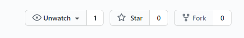
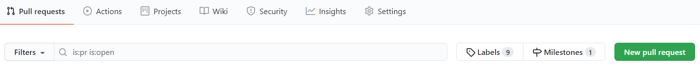
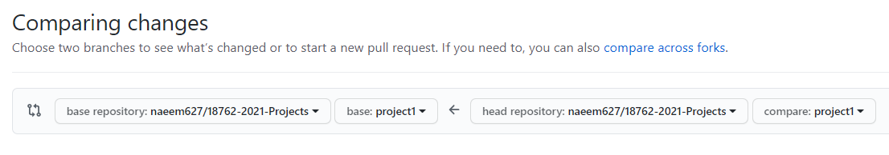
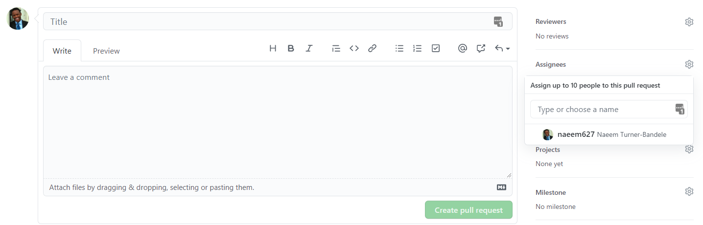

# 18762 - Circuit Simulation and Optimization Methods: A Power Systems Perspective

This repository will house all projects for the course. Follow the setup and submission instructions outlined below.

## Projects
For each project you work on, please use the appropriate project branch.
- Project 1 Branch - project1
- Project 2 Branch - project2
- Project 3 Branch - project3

Any test cases, readers, or parsers that we are giving to you to complete a project will be on their respective 
project branch.

## Git Help
Working on these projects will require you to have some knowledge of Git. If you've never used Git before or need a 
refresher, check out the [GitHub Git cheat sheet](docs/git-cheat-sheet-education.pdf) and the [NDP Software Git 
Cheatsheet](http://ndpsoftware.com/git-cheatsheet.html#loc=workspace;).

## Setup
### Step 1: Fork this repository

In the top right corner, click **fork**. Forking this repository will allow you to implement your work without 
changing the original repository.




### Step 2: Create a local clone of your fork
```
git clone https://github.com/YOUR-USERNAME/18762-2021-Projects
```
### Step 3: Create a working directory
```
mkdir project/YOUR-ANDREWID
```
You will work on your solution in this working directory. Please do this for each project you work on.

### Step 4: Implement your solution
Implement your solution to the project assignment within the working directory.

## Submission
When you complete a project, you will submit a merge request to indicate that your project is complete and that your 
work is ready for review.
### Step 1: Start a Pull Request
In GitHub, on the navbar at the top, click **Pull Requests**.
Next, click **New pull request**.


### Step 2: Compare the Source Branch with Your Project Branch

Compare across forks by comparing your project branch with the base repository project branch. For the source branch, 
select the source branch that matches the project you are preparing to submit (e.g., project1, project2, project3). 
Do the same thing for the target branch (e.g., project1, project2, project3). Once finished, hit compare branches and 
continue.

### Step 2: Enter the details of your Pull Request and submit
Under the title field, please put the name of the project you're submitting. Under "Write", please put any 
comments you'd like to make about your project submission. Next, set the **Assignee** to tgmcnamara and 
the **Milestone** to the project you've just completed. Finally, submit the pull request.


